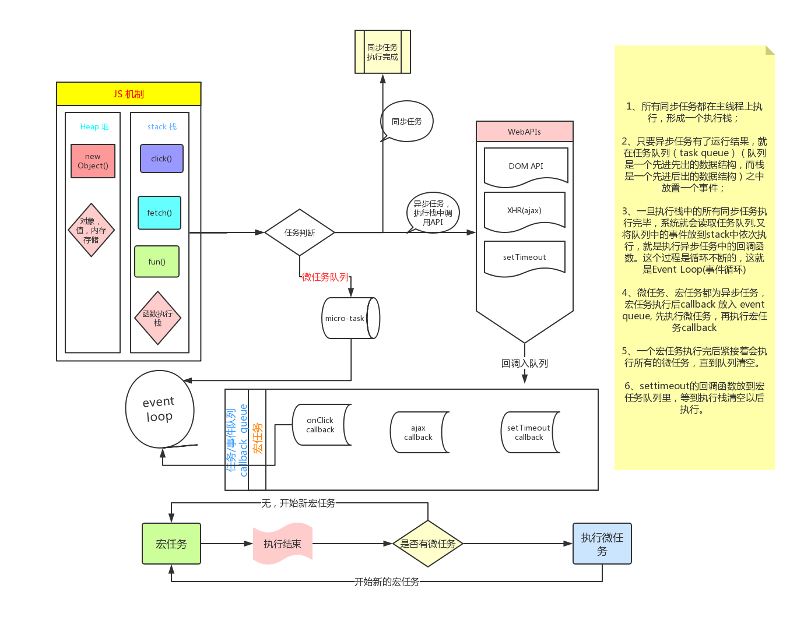

# 异步

### 异步操作的方法

1. 回调(无法获得错误，回调地狱，一次只能一个callback，阅读困难，)
2. promise(错误要依靠回调函数，promise链太长不方便阅读，一旦运行不能停止不能取消)
3. 基于generator的async await

## async await

- 基于generator的语法糖
- async函数返回一个promise对象
- 遇到await时执行停止(单句之后执行一遍)，等待之后的代码有执行结果后再继续执行(无论之后是否返回promise)，之后的内容加入微任务
- 使用try-catch捕获异常
- await之后的语句放入一个新的promise，下一行的语句放入这个promise的then中

### promise的理解

- 同步立即执行函数（构造函数），返回一个对象（promise对象）
- 接受一个函数作为参数，这个函数用一个resolve和reject作为参数，用于改变对象的状态表示异步操作完成后的返回值（result）
- 这个对象对应了一个异步操作，有三个状态（fullfilled，pending，rejected）
- 属于微任务
- 相对于回调的好处：可以通过自然顺序编写代码，增加可读性，可以在一个promise上多次操作，解决了callback hell的问题

### promise api

- then()添加回调函数(属于微任务！，promise内部的代码是立即执行的),参数是一个函数函数函数！**如果then前面不是一个promise会被包裹成一个promise**
- finally()无论错误还是成功都会执行，不会返回，除了错误之外
- catch()，能够捕获写在她之前的所有错误
- priomise.all()
  - 接受一个promise数组，返回一个结果数组
  - 如果出现错误，其他都会被忽略，只返回数组
- promise.allsettled()
  - 和上一个方法不同的是，错误的也会被返回
- promise.race()
  - 接受一个promise数组，只返回第一个有结果的promise
- promise.any()
  - 与上一个不同的是，它只返回第一个成功的promise

>promise只能处理executor的错误，异步产生的错误无法处理(比如settimeout中)

## event loop

>在执行上下文栈的同步任务执行完后；
>首先执行Microtask队列，按照队列先进先出的原则，一次执行完所有Microtask队列任务；
>然后执行Macrotask/Task队列，一次执行一个，一个执行完后，检测 Microtask是否为空；
>为空则执行下一个Macrotask/Task；
>不为空则执行Microtask